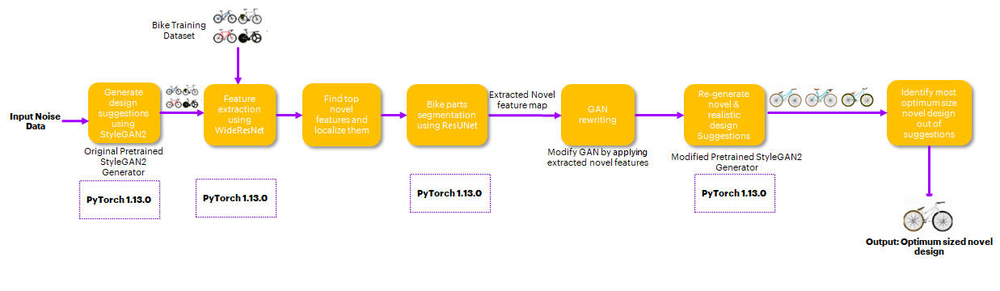
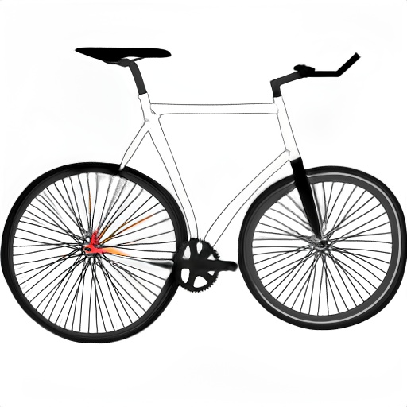
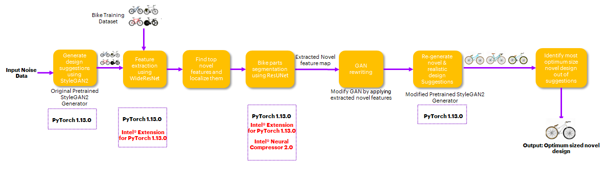
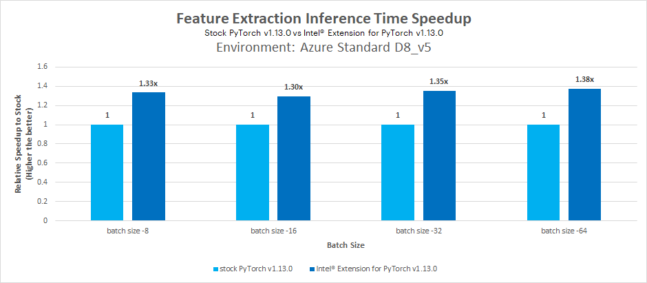
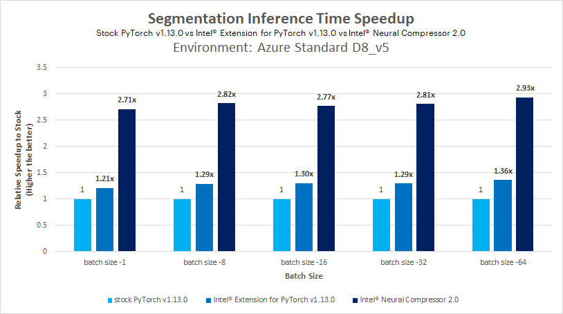
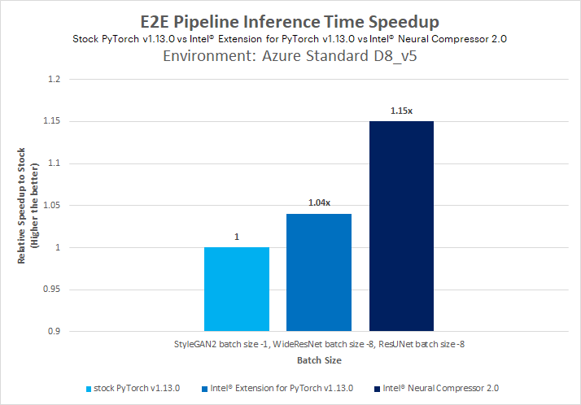

# **Engineering Design Optimizations**
## **Table of Contents**
 - [Purpose](#Purpose)
 - [Reference Solution](#proposed-solution)
 - [Reference Implementation](#Reference-Implementation)
 - [Intel® Optimized Implementation](#optimizing-the-E2E-solution-with-Intel®-oneAPI)
 - [Performance Observations](#performance-observations)

## **Purpose**
In the past, products were mainly valued by customers for their utility. Gradually, aesthetics, novelty and slick designs have also become important factors among other factors that customers look for when purchasing products. Designers and engineers in the manufacturing industry often struggle with introducing novelty as it is a time-consuming process that includes iterating through multiple designs, comparing designs, ensuring that utility and quality of products are not compromised on account of design changes, etc. Depending on the product or tool being designed, it could take days, months or even years to come up with the right design for a product that meets the usefulness, novelty, and quality criteria for products.  

Customers have become extremely demanding over the years and expect new products to be introduced often. Companies also run the risk of losing market share to competitors if they are unable to keep up with customer demands.  

Generative design is the next frontier in CAD design for engineers working in virtually all manufacturing industries. It harnesses the power of artificial intelligence (AI) to develop new high-performance design iterations that help solve complex challenges, reduce component weights and manufacturing costs, scale customization, optimize performance and reduce product development cycle time.  

This reference kit demonstrates how Generative Adversarial Networks can be used to optimize and improve novelty in product design.

## **Reference Solution**
Conventional engineering design methods involve exploring designs and ideas interactively and even sometimes manually which add time and complexity to the design exploration. In fact, designers should spend vital time examining various design alternatives till they determine helpful solutions, so GAN data-driven methods such as the one described in this reference kit can enable designers to quickly synthesize new designs by reducing the complexity of design exploration.
This reference kit is a data-driven reference solution for design synthesis and proposes a method for guiding existing GAN models to synthesize novel designs. A state-of-the-art [StyleGAN2](https://github.com/lucidrains/stylegan2-pytorch) model is used to generate realistic designs. Other models (WideResNet, ResUNet) are then applied to automatically detect and locate the novel features in the generated designs, to then rewrite the original StyleGAN2 model using the detected most novel features through the concept of [rewriting GANs](https://rewriting.csail.mit.edu/).\
<br>Using a bicycle designs dataset to re-train the model, the StyleGAN2  model can create new bicycle designs with unique frames and handles, and generalize rare novelties to a broad set of designs, completely automatic and without requiring human intervention. As a post-processing step, a custom algorithm is applied on generated novel design images to suggest the most compact and novel designs.
### *Key Implementation Details*
The method implemented in this reference kit leverages multiple models and machine learning algorithms to detect the novel features and applies these features to rewrite the original GAN model. Details of the components implemented are as follows:
1. StyleGAN2 model architecture to synthesize design images
2. Novelty Detection and localization\
   a. WideResNet model architecture to extract features from the GAN generated images and training dataset\
   b. Find the top novel features and localize them in the image\
   c. ResUNet based segmentation model architecture to predict the part of the bike for a new novel design image
3. Rewrite the original StyleGAN2 model using detected most novel features.

As Generative Adversarial Networks (GANs) models are often slow to generate images, the overall process of generating the novel and optimized design is relatively slow. This reference kit also demonstrates how Intel® AI Analytics Toolkit can help in minimize the time taken by GAN and other deep learning models used in generating the most optimized and novel design and in accelerating the overall process. This will help productionize the suggested method to generate the novel designs on scale.

Three benchmarkings are performed in this reference kit and are as follows:
1. Feature Extraction Inference time - Stock vs Intel® Extension for PyTorch
2. Segmentation Inference time- Stock vs Intel® Extension for PyTorch vs Intel® Neural Compressor
3. E2E pipeline Inference time - Stock vs Intel® Extension for PyTorch vs Intel® Neural Compressor

> Note: Additional info/inputs required from Intel on Quantization of models (Currently quantization done for models in E2E pipeline)

## **Reference Implementation**
The reference implementation of different deep learning models in this reference kit is based on PyTorch v1.13.0.
<br>The StyleGAN2 model used in this implementation to generate bike design images is pre-trained on the Biked Dataset . Then, the novelty feature detection and localization method, which relies on features extracted from generated images using a pre-trained Wide Residual Newtorks50 (WideResNet50) architecture and a pre-trained ResUNet based segmentation model architecture used to segment the different parts of the bike in the generated bike design images. Finally, the segmented feature mask is used to modify the StyleGAN2 model using the model rewriting approach so that it generates the most novel and optimized bike designs.
### **Use Case E2E Flow**



### **Experiment Details**

### **Expected Input-Output**

**Input**                                         | **Output** | 
| :---: | :---: |
| Random Noise Data (400x512 size vector to generate 10 design images)|      Novel and Optimized Bike Design Image (512x512x3 size image)|

### **Reference Sources**
**Case Study Reference:**
https://github.com/mfrashad/creativegan

### ***Software Requirements***

1. Python v3.9.15
2. PyTorch v1.13.0
3. Intel® Extension for PyTorch v1.13.0
4. Intel® Neural Compressor v2.0

### ***Solution Setup Prerequisite***
#### ***Anaconda Installation***
Note that this reference kit implementation already provides the necessary scripts to setup the software requirements. 
To utilize these environment scripts, first install Anaconda/Miniconda by following the instructions at the following link

https://docs.conda.io/projects/conda/en/latest/user-guide/install/index.html
or
[Anaconda installation](https://docs.anaconda.com/anaconda/install/linux/)\
**Note: If the conda is installed using pip, it will not work for this purpose. So please install conda from the above link only.**

### ***Reference Solution Setup***
### ***Repository Clone:***
Clone the repository to the desired location on your computer using the command given below:
```sh
git clone https://github.com/oneapi-src/engineering-design-optimization
cd engineering-design-optimization
```
> Note: It is assumed that the present working directory is the root directory of this code repository. You can verify the present working directory location using the following command.
```sh
pwd
```
```
output: 
<Absolute path to cloned directory>/engineering-design-optimization
```
### ***Apply Solution Patch***
> The original repo has been restructured and modified to add some post-processing steps and to enable it for Intel optimizations to use this reference kit. A patch has been provided of these changes for users to apply on top of original repo.
Steps to apply the patch are as follows:
```
cd src
git clone https://github.com/mfrashad/creativegan.git
cd creativegan
git reset --hard 9b1abc2afdac2d9e168422613a457158f5952ad0
git apply --reject --whitespace=fix  ../creativegan_patch.patch
cd ..
mv run_benchmark_feature_extraction.py creativegan/run_benchmark_feature_extraction.py
mv run_benchmark_resunet.py creativegan/run_benchmark_resunet.py
cd ..
```
> Note: It is assumed that the present working directory is the root directory of this code repository. You can verify the present working directory location using the following command. 
### ***Stock Environment Setup***
Follow the below conda installation commands to setup the Stock environment along with the necessary packages for this model training and prediction.
```sh
conda env create --file env/stock/eng-design-stock.yml
```
This command utilizes the dependencies found in the `env/stock/eng-design-stock.yml` file to create an environment as follows:

**YAML file**                       | **Environment Name**         |  **Configuration** |
| :---: | :---: | :---: |
| `env/stock/eng-design-stock.yml`             | `eng-design-stock` | Python v3.9.15, PyTorch v1.13.0

Use the following command to activate the environment that was created:
*Activate stock conda environment*
```sh
conda activate eng-design-stock
```
###  **Dataset and Pretrained Models**

**Dataset**                     |  **Dataset Reference**                      |**Pretrained Models**                                                                                |**Pretrained Models Reference** |
| :---:                         | :---:                                       | :---:                                                                                               | :---: |
| Bicycle design images : 4512   | https://github.com/Lyleregenwetter/BIKED   |StyleGAN2 model pretrained on Biked dataset, Segmentation model pretrained on Bike Part dataset      |https://github.com/mfrashad/creativegan

#### ***Biked Dataset***
In this reference solution, Biked dataset has been used which is a diverse assortment of 4512 manually-designed bicycle models that span all common bicycle styles and feature unique models from remote corners of the bicycle design space.

#### ***Pretrained Models***
In this reference solution, pretrained models have been used for StyleGAN2 image generation model and ResUNet Segmentation model.

A python script "src/download.sh" has been provided in the source code to download both dataset and pretrained models.\
Run the following command to download the dataset and pretrained models.
```
sh src/download.sh
```
After running the above command, "datasets" and "models" folders will be created in the root directory of the code repository and dataset and pretrained models will be downloaded and extracted in the respective folders.
###  **Benchmarking**

#### ***Novel Feature Extraction***
This module uses pretrained WideResNet model to extract features from training images.
```
usage: python src/creativegan/run_benchmark_feature_extraction.py [--data_path][--intel][--novelty_infer_batch_size][--use_quantized_models][--wideresnet_quantized_model_path]
```

Arguments:<br>
```
  --data_path                         Path to dataset, the folder should directly contain the images
  --intel                             Give 1 for enabling intel PyTorch optimizations, default is 0  
  --novelty_infer_batch_size          Batch size to extract the features from design images using WideResNet model
  --use_quantized_models              Use INC Quantized model in pipeline
  --wideresnet_quantized_model_path   WideResNet quantized model path

```
<b>Example:</b>
```sh
python src/creativegan/run_benchmark_feature_extraction.py \
 --data_path ./datasets/biked_subset \
 --intel 0 \
 --novelty_infer_batch_size 32 \
 --use_quantized_models 0
```

#### ***Novel feature extraction by Parts using ResUNet Segmentation Model***
This module uses pretrained ResUNet model to segment novel feature masks from extracted features.
```
usage: run_benchmark_resunet.py [-h] -d DATA_PATH [-i INTEL] [-b BATCH_SIZE] [-uqm] -m SEG_MODEL_PATH [-qm QUANT_SEG_MODEL_PATH] [-cls SEG_TOTAL_CLASS]
```

Arguments:<br>
```
-d DATA_PATH, --data_path DATA_PATH Path to dataset, the folder should directly contain the images
-i INTEL, --intel INTEL To apply Intel IPEX optimization
-b BATCH_SIZE, --batch_size BATCH_SIZE Batch size to be used by the model for inference
-uqm, --use_quantized_models Use INC Quantized model in pipeline
-m SEG_MODEL_PATH, --seg_model_path SEG_MODEL_PATH Path to segmentation model
-qm QUANT_SEG_MODEL_PATH, --quant_seg_model_path QUANT_SEG_MODEL_PATH Path to quantized segmentation model
-cls SEG_TOTAL_CLASS, --seg_total_class SEG_TOTAL_CLASS Total class/channel in segmentation model  
```
<b>Example:</b>
```sh
python src/creativegan/run_benchmark_resunet.py \
 --data_path ./datasets/biked_subset \
 --intel 0 \
 --batch_size 32 \
 --seg_model_path ./models/segmentation_bike.pt \
 --seg_total_class 7
```

#### ***End-to-End Novel Design Generation Pipeline***
The end-to-end pipeline script given below is used to generate most novel, unique and optimized bike design suggestions. In this pipeline, pretrained StyleGAN2 model has been used to generate unique design suggestions, pretrained WideResNet model has been used to extract novel features in the suggested designs and pretrained ResUNet model has been used to segment the novel feature mask in the design images. The segmented feature masks have been used to modify the StyleGAN2 model using model rewriting approach so that it generates most novel and optimized bike designs.

```
usage: sh src/experiment.sh
```
The following parameters can be configured in the above script as per the current configuration and need.
```
--model_path                            Path to pretrained StyleGAN2 model
--seg_model_path                        Path to pretrained Segmentation model
--data_path                             Path to dataset, the folder should directly contain the images
--copy_id                               Random seed to create a noise to input to the pipeline
--gan_infer_batch_size                  Batch size to generate design samples using StyleGAN2 model (should be less than 14 as per the given machine configuration)
--segment_infer_batch_size              Batch size to segment the design images using UNET model
--novelty_infer_batch_size              Batch size to extract the features from design images using WideResNet model (between 32-512 as per the given machine configuration)
--intel                                 Give 1 for enabling intel PyTorch optimizations, default is 0
```
Output of this pipeline is the most optimized bike design image, which will be saved as "best_design_image.jpg" in current directory.

<b>Example:</b>
```sh
sh src/experiment.sh
```

**Sample output**



## **Optimizing the E2E solution with Intel Optimizations for Engineering Design Optimizations**
In order to derive the most insightful and beneficial actions to take, the data generated through various feature sets and algorithms needs to be analysed, thus requiring frequent re-runs of the algorithms under many different parameter sets. To utilize all the hardware resources efficiently, software 
optimizations cannot be ignored.   
 
This reference kit solution extends to demonstrate the advantages of using the Intel® AI Analytics Toolkit on the task of building a pipeline for generating optimized engineering designs.

### Use Case E2E flow


### **Optimized Solution Setup**

#### ***Intel Environment Setup***
Follow the below conda installation commands to setup the Intel environment along with the necessary packages.
>Note: It is assumed that the present working directory is the root directory of this code repository

```shell
conda env create --file env/intel/eng-design-intel.yml
```
This command utilizes the dependencies found in the `env/intel/eng-design-intel.yml` file to create an environment as follows:

**YAML file**                                 | **Environment Name** |  **Configuration** |
| :---: | :---: | :---: |
| `env/intel/eng-design-intel.yml`             | `eng-design-intel` | Python v3.9.15 with Intel® Extension for PyTorch v1.13.0

Intel environment will be used for the workload implementation to arrive at first level solution.

Use the following command to activate the environment that was created:
```shell
conda activate eng-design-intel
```
#### ***Optimized Software Components***
Intel® Extension for PyTorch (version 1.13.0) framework has been optimized using oneAPI Deep Neural Network Library (oneDNN) primitives, a popular performance 
library for deep learning applications. It provides accelerated implementations of numerous popular DL algorithms that optimize performance on 
Intel® hardware only requiring simple lines of modifications to existing code.

**Intel® Extension for PyTorch (IPEX)** extends PyTorch with Optimizations for extra performance boost on Intel hardware.
The below changes have been done to the stock PyTorch training code base to utilize the Intel® Extension for PyTorch* performance.
One can enable the intel flag to incorporate below Intel PyTorch optimizations.
```
import intel_extension_for_pytorch  as ipex

model=ipex.optimize(model)
```
###  **Benchmarking**

#### ***Intel Optimized Novel Feature Extraction***
This module uses pretrained WideResNet model to extract features from training images.
```
usage: python src/creativegan/run_benchmark_feature_extraction.py [--data_path][--intel][--novelty_infer_batch_size][--use_quantized_models][--wideresnet_quantized_model_path]
```

Arguments:<br>
```
  --data_path                         Path to dataset, the folder should directly contain the images
  --intel                             Give 1 for enabling intel PyTorch optimizations, default is 0  
  --novelty_infer_batch_size          Batch size to extract the features from design images using WideResNet model
  --use_quantized_models              Use INC Quantized model in pipeline
  --wideresnet_quantized_model_path   WideResNet quantized model path

```
<b>Example:</b>
```sh
python src/creativegan/run_benchmark_feature_extraction.py \
 --data_path ./datasets/biked_subset \
 --intel 1 \
 --novelty_infer_batch_size 32 \
 --use_quantized_models 0
```

#### ***Intel Optimized Novel feature extraction by Parts using ResUNet Segmentation Model***
This module uses pretrained ResUNet model to segment novel feature masks from extracted features.
```
usage: run_benchmark_resunet.py [-h] -d DATA_PATH [-i INTEL] [-b BATCH_SIZE] [-uqm] -m SEG_MODEL_PATH [-qm QUANT_SEG_MODEL_PATH] [-cls SEG_TOTAL_CLASS]
```

Arguments:<br>
```
-d DATA_PATH, --data_path DATA_PATH Path to dataset, the folder should directly contain the images
-i INTEL, --intel INTEL To apply Intel IPEX optimization
-b BATCH_SIZE, --batch_size BATCH_SIZE Batch size to be used by the model for inference
-uqm, --use_quantized_models Use INC Quantized model in pipeline
-m SEG_MODEL_PATH, --seg_model_path SEG_MODEL_PATH Path to segmentation model
-qm QUANT_SEG_MODEL_PATH, --quant_seg_model_path QUANT_SEG_MODEL_PATH  Path to quantized segmentation model
-cls SEG_TOTAL_CLASS, --seg_total_class SEG_TOTAL_CLASS Total class/channel in segmentation model  
```
<b>Example:</b>
```sh
python src/creativegan/run_benchmark_resunet.py \
 --data_path ./datasets/biked_subset \
 --intel 1 \
 --batch_size 32 \
 --seg_model_path ./models/segmentation_bike.pt \
 --seg_total_class 7
```

#### ***Intel Optimized End-to-End Novel Design Generation Pipeline***
The end-to-end pipeline script given below is used to generate most novel, unique and optimized bike design suggestions. In this pipeline, pretrained StyleGAN2 model has been used to generate unique design suggestions, pretrained WideResNet model has been used to extract novel features in the suggested designs and pretrained ResUNet model has been used to segment the novel feature mask in the design images. The segmented feature masks have been used to modify the StyleGAN2 model using model rewriting approach so that it generates the most novel and optimized bike designs.

```
usage: sh src/intel-experiment.sh
```
The following parameters can be configured in the above script as per the current configuration and need.
```
--model_path                            Path to pretrained StyleGAN2 model
--seg_model_path                        Path to pretrained Segmentation model
--data_path                             Path to dataset, the folder should directly contain the images
--copy_id                               Random seed to create a noise to input to the pipeline
--gan_infer_batch_size                  Batch size to generate design samples using StyleGAN2 model (should be less than 14 as per the given machine configuration)
--segment_infer_batch_size              Batch size to segment the design images using UNET model
--novelty_infer_batch_size              Batch size to extract the features from design images using WideResNet model (between 32-512 as per the given machine configuration)
--intel                                 Give 1 for enabling intel PyTorch optimizations, default is 0
```
Output of this pipeline is the most optimized bike design image, which will be saved as "best_design_image.jpg" in current directory.

<b>Example:</b>
```sh
sh src/intel-experiment.sh
```
**Sample output**


### **Model Conversion using Intel® Neural Compressor**
Intel® Neural Compressor is used to quantize the FP32 Model to the INT8 Model.
Intel® Neural Compressor supports many optimization methods. Here, post-training optimization with `Default quantization mode` method has been used to 
quantize the FP32 model.

##### **Quantization of ResUNet Model**

The below script is used to quantize the pretrained ResUNet FP32 segmentation model. The output of this script is the quantized ResUNet INT8 segmentation model.
```
usage: python src/quantize_resunet_inc.py [--model_path] [--out_path]
```

Arguments:
```
  --model_path             Path to pretrained FP32 segmentation model       
  --out_path               Directory path to save the quantized INT8 segmentation model
```

<b>Example</b>
```sh
python src/quantize_resunet_inc.py --model_path './models/segmentation_bike.pt' --out_path './models/quantized_segmentation_model'
```
The above script will quantize the FP32 segmentation model and save the quantized INT8 segmentation model in the "./models/quantized_segmentation_model" directory.

To use Quantized Model for inference, run the below command.
```sh
python src/creativegan/run_benchmark_resunet.py \
 --data_path ./datasets/biked_subset \
 --intel 1 \
 --batch_size 32 \
 --seg_model_path ./models/segmentation_bike.pt \
 --seg_total_class 7 \
 --use_quantized_models \
 --quant_seg_model_path ./models/quantized_segmentation_model/best_model.pt
```


#### ***Intel Optimized Implementation of End-to-End Novel Design Generation using Intel® Neural Compressor Quantized Int8 Models***
The end-to-end pipeline script given below is used to generate most novel, unique and optimized bike design suggestions. In this pipeline, pretrained StyleGAN2 model has been used to generate unique design suggestions, pretrained WideResNet model has been used to extract novel features in the suggested designs and pretrained ResUNet model has been used to segment the novel feature mask in the design images. The segmented feature masks have been used to modify the StyleGAN2 model using model rewriting approach so that it generates most novel and optimized bike designs.

```
usage: sh src/inc-experiment.sh
```
The following parameters can be configured in the above script as per the current configuration and need.
```
--model_path                            Path to pretrained StyleGAN2 model
--seg_model_path                        Path to pretrained Segmentation model
--data_path                             Path to dataset, the folder should directly contain the images
--copy_id                               Random seed to create a noise to input to the pipeline
--gan_infer_batch_size                  Batch size to generate design samples using StyleGAN2 model (should be less than 14 as per the given machine configuration)
--segment_infer_batch_size              Batch size to segment the design images using UNET model
--novelty_infer_batch_size              Batch size to extract the features from design images using WideResNet model (between 32-512 as per the given machine configuration)
--intel                                 Give 1 for enabling intel PyTorch optimizations, default is 0
--resunet_quantized_model_path          Path to quantized INT8 segmentation model
```
Output of this pipeline is the most optimized bike design image, which will be saved as "best_design_image.jpg" in current directory.

<b>Example:</b>
```sh
sh src/inc-experiment.sh
```

## **Performance Observations**
This section covers the novelty detection (feature extraction) time comparison between Stock PyTorch version and Intel PyTorch Extension for WideResNet model. The results are used to calculate the performance gain achieved by using Intel One API packages over 
stock version of similar packages.


<br>**Takeaway**<br>Intel® PyTorch Extension with Intel Optimizations offers batch inference time speed-up of 
1.38x using pretrained model compared to stock versions without Intel Optimizations.

This section covers the segmentation time comparison between Stock PyTorch version and Intel PyTorch Extension for ResUNet model. The results are used to calculate the performance gain achieved by using Intel One API packages over 
stock version of similar packages.


<br>**Takeaway**<br>Intel® PyTorch Extension with Intel Optimizations offers batch inference time speed-up of 
1.36x using pretrained model compared to stock versions without Intel Optimizations.
<br>Intel® PyTorch Extension with Intel Optimizations and Intel® Neural Compressor offers batch inference time speed-up of 
2.93x using pretrained model compared to stock versions without Intel Optimizations. 

This section covers the end-to-end novel image generation (image generation, image segmentation and feature extraction) time comparison between Stock PyTorch version and Intel PyTorch Extension for StyleGAN2, ResUNet and WideResNet model. The results are used to calculate the performance gain achieved by using Intel One API packages over 
stock version of similar packages.


<br>**Takeaway**<br>Intel® PyTorch Extension with Intel Optimizations and Intel® Neural Compressor collectively offers batch inference time speed-up of 
1.04x using pretrained models compared to stock versions without Intel Optimizations for end-to-end pipeline.

#### **Conclusion**
This reference kit can be used by any ML engineer for creating optimized engineering designs and also accelerate their implementation using the Intel® oneAPI packages.

### Notices & Disclaimers
Performance varies by use, configuration, and other factors. Learn more on the [Performance Index site](https://edc.intel.com/content/www/us/en/products/performance/benchmarks/overview/). 
Performance results are based on testing as of dates shown in configurations and may not reflect all publicly available updates. See backup for configuration details.  No product or component can be absolutely secure. 
Costs and results may vary. 
Intel technologies may require enabled hardware, software or service activation. <br>
© Intel Corporation. Intel, the Intel logo, and other Intel marks are trademarks of Intel Corporation or its subsidiaries.  Other names and brands may be claimed as the property of others.  

**Date Testing Performed**: March 2023 

**Configuration Details and Workload Setup**: Azure D8v5 (Intel® Xeon® Platinum 8370C CPU @ 2.80GHz), 1 Socket, 4 Cores per Socket, 2 Threads per Core, Turbo: On, Total Memory: 32 GB, OS: Ubuntu 20.04, Kernel: Linux 5.15.0-1019-azure. Framework/Toolkit: PyTorch v1.13.0, Intel® Extension for PyTorch v1.13.0, Intel® Neural Compressor v2.0, Python 3.9.15. Dataset size: ~2k training RGB images of bike Model: StyleGAN2 for image generation, WideResNet for feature extraction and ResUNet for segmentation of novel features. 

**Testing performed by** Intel Corporation

## Appendix
### **Running on Windows**
The reference kits commands are linux based, in order to run this on Windows, goto Start and open WSL and follow the same steps as running on a linux machine starting from git clone instructions. If WSL is not installed you can [install WSL](https://learn.microsoft.com/en-us/windows/wsl/install).
> **Note** If WSL is installed and not opening, goto Start ---> Turn Windows feature on or off and make sure Windows Subsystem for Linux is checked. Restart the system after enabling it for the changes to reflect.

### **Experiment setup**

| Platform                          | Ubuntu 20.04
| :---                              | :---
| Hardware                          | Azure Standard_D8_V5 (Icelake)
| Software                          | Intel® Distribution for Python v3.9.15, Intel® Extension for PyTorch v1.13.0, Intel® Neural Compressor v2.0
| What you will learn               | Advantage of using components in Intel® Extension for PyTorch over the stock versions


### Known Issues

1. Common prerequisites required to run python scripts in linux system.
    Install gcc and curl.  For Ubuntu, this will be: 

      ```bash
      apt-get update
      apt-get install gcc
      apt-get install git
      ```

2. ImportError: libGL.so.1: cannot open shared object file: No such file or directory
   
    **Issue:**
      ```
      ImportError: libGL.so.1: cannot open shared object file: No such file or directory
      or
      libgthread-2.0.so.0: cannot open shared object file: No such file or directory
      ```

    **Solution:**

      Install the libgl1 and libglib2.0-0 libraries. For Ubuntu this will be:

      ```bash
     sudo apt install libgl1
     sudo apt install libglib2.0-0
      ```
3. Optimization instructions for StyleGAN2 and quantization instructions for StyleGAN2 and WideResNet, as well as performance benchmarks, to come.